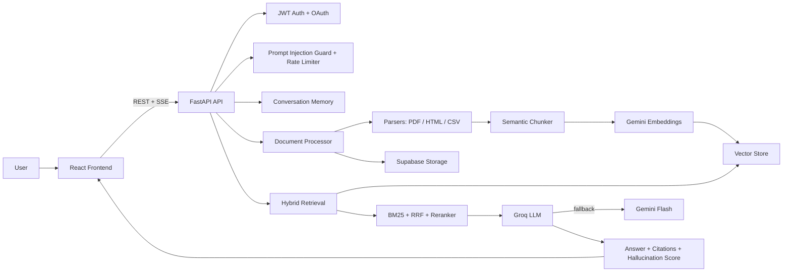

# ScaleRAG Architecture

## Diagram

## Key design choices

- Ingestion supports `PDF`, `HTML`, and `CSV`, with OCR fallback for scanned PDFs.
- Retrieval uses dense embeddings plus sparse BM25 and fuses both rankings with RRF before reranking.
- Context is compressed before generation to reduce latency and cost.
- Generation streams over SSE and persists conversation history for follow-up questions.
- Reliability features include prompt-injection checks, suspicious-context sanitization, rate limiting, worker retries, health checks, and model fallback.
- Production profile uses Supabase Postgres + pgvector; local/demo fallback works with SQLite plus Python cosine search.
